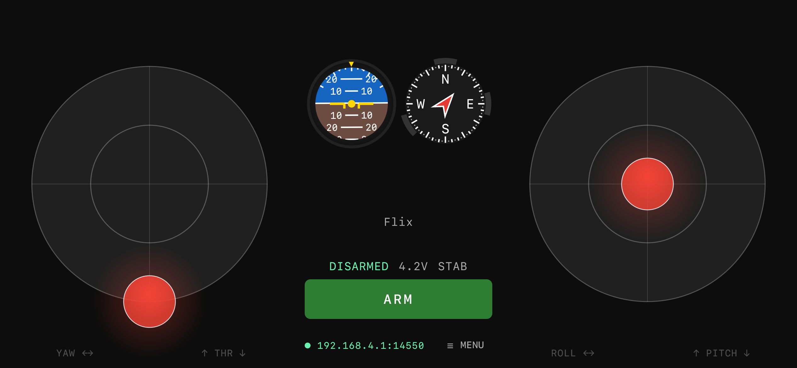

# Mavlink Joystick

User-friendly iOS/Android joystick for controlling vehicles and robots via MAVLink protocol. Supports Flix/ArduPilot/PX4 drones out-of-the-box.

## Features

- **MAVLink v2 over UDP** - control any vehicle or robot with MANUAL_CONTROL message from your iOS/Android smartphone via WiFi
- **Customizable sticks** - size, appearance and even curve for each axis can be changed
- **Artificial horizon and compass** - intuitive orientation visualization from ATTITUDE_QUATERNION message
- **Status bar** - armed/voltage/mode display
- **Mavlink console** - for low-level autopilot setup

## Build

This is [Kotlin Multiplatform](https://www.jetbrains.com/help/kotlin-multiplatform-dev/get-started.html) application, so you can build the app for iOS and Android.

### Build and Run Android Application

- Open this repo in Android Studio (Panda 4 is recommended)
- To build and run the development version of the Android app, use the run configuration from Android Studio toolbar (androidApp)

### Build and Run iOS Application

- Get something with MacOS
- To build and run the development version of the iOS app, open [iosApp.xcodeproj](./iosApp/iosApp.xcodeproj) in Xcode and run it from there
- After that you will be able to run iOS app from Android Studio

## Connect to drone

App listens 14550 udp port by default and connects to first drone, which sends MAVLink heartbeat. You can change listen port in connection settings.

## Safety Notes

- **Always test in a safe, open area.**
- Throttle holds position when released (real transmitter behaviour).
- All other axes spring back to centre on release.
- The app does **not** enforce geo-fencing or failsafes — those must be configured on the flight controller.
